# IMS Books (Song Book Library) — High-Level and Low-Level Design

All diagrams are Mermaid (they render on GitHub and in IntelliJ's Markdown preview).
This document reflects the code on `feature-sms` (Flyway V1–V4: mobile identity, registration without SMS,
PUBLISHER role). Related detail: [ARCHITECTURE.md](ARCHITECTURE.md) (ADRs), [DATABASE_ERD.md](DATABASE_ERD.md),
[API_SPECIFICATION.md](API_SPECIFICATION.md), [SECURITY.md](SECURITY.md), [AZURE_DEPLOYMENT.md](AZURE_DEPLOYMENT.md).

---

# Part 1 — High-Level Design (HLD)

## 1.1 Purpose and scope

A web library of song books (PDFs). Guests browse the catalogue; registered members with a valid membership
read books online or download them; publishers upload and maintain their own books; admins manage users,
memberships, categories, all books, member requests and the audit log.

| Actor | Persisted role | Can do |
|---|---|---|
| Guest | none (anonymous) | Browse catalogue, view book details and covers, register, sign in |
| Member | `MEMBER` | Read / download PDFs (valid membership), reading progress, profile, mobile change, modification requests |
| Publisher | `PUBLISHER` | Create books, upload new versions and covers, edit/archive **own** books |
| Admin | `ADMIN` | Everything; bypasses the membership check for reading (decision D3) |

## 1.2 System context

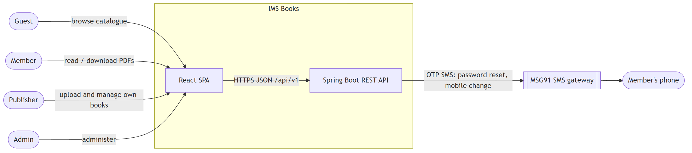

<details><summary>Mermaid source</summary>

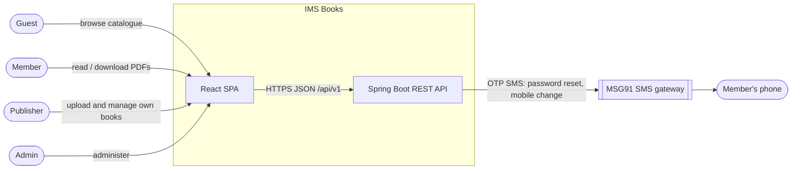
```mermaid
flowchart LR
    guest([Guest])
    member([Member])
    publisher([Publisher])
    admin([Admin])

    subgraph ims [IMS Books]
        spa[React SPA]
        api[Spring Boot REST API]
    end

    msg91[[MSG91 SMS gateway]]
    phone([Member's phone])

    guest -->|browse catalogue| spa
    member -->|read / download PDFs| spa
    publisher -->|upload and manage own books| spa
    admin -->|administer| spa
    spa -->|HTTPS JSON /api/v1| api
    api -->|OTP SMS: password reset, mobile change| msg91
    msg91 --> phone
```

</details>

## 1.3 Deployment architecture (Azure)

One resource group per environment (`dev`, `prod`), defined in `infra/main.bicep`.

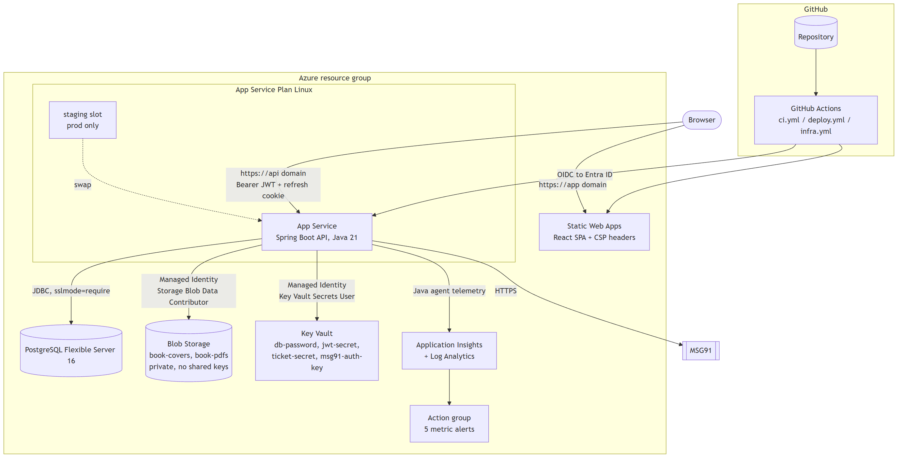

<details><summary>Mermaid source</summary>

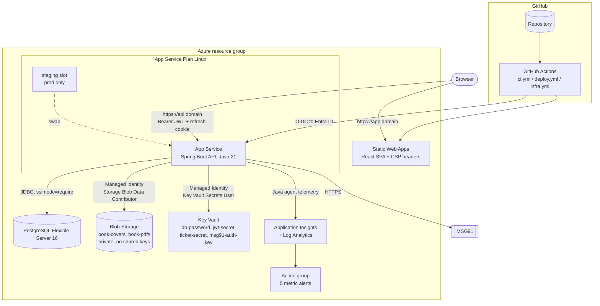
```mermaid
flowchart TB
    browser([Browser])

    subgraph gh [GitHub]
        repo[(Repository)]
        actions[GitHub Actions<br/>ci.yml / deploy.yml / infra.yml]
    end

    subgraph az [Azure resource group]
        swa[Static Web Apps<br/>React SPA + CSP headers]
        subgraph appsvc [App Service Plan Linux]
            app[App Service<br/>Spring Boot API, Java 21]
            slot[staging slot<br/>prod only]
        end
        pg[(PostgreSQL Flexible Server 16)]
        blob[(Blob Storage<br/>book-covers, book-pdfs<br/>private, no shared keys)]
        kv[Key Vault<br/>db-password, jwt-secret,<br/>ticket-secret, msg91-auth-key]
        ai[Application Insights<br/>+ Log Analytics]
        alerts[Action group<br/>5 metric alerts]
    end

    msg91[[MSG91]]

    browser -->|https://app domain| swa
    browser -->|https://api domain<br/>Bearer JWT + refresh cookie| app
    app -->|JDBC, sslmode=require| pg
    app -->|Managed Identity<br/>Storage Blob Data Contributor| blob
    app -->|Managed Identity<br/>Key Vault Secrets User| kv
    app -->|Java agent telemetry| ai
    ai --> alerts
    app -->|HTTPS| msg91
    repo --> actions
    actions -->|OIDC to Entra ID| app
    actions --> swa
    slot -.swap.-> app
```

</details>

Notes:
- The SPA and API use custom domains on the **same site**, so the `SameSite=Strict` refresh cookie is sent
  cross-origin (CORS with credentials). On default `*.azurewebsites.net` hosts the cookie would be dropped.
- The browser never talks to Blob Storage. Covers and PDFs are streamed through the API (ADR-4).

## 1.4 Logical architecture

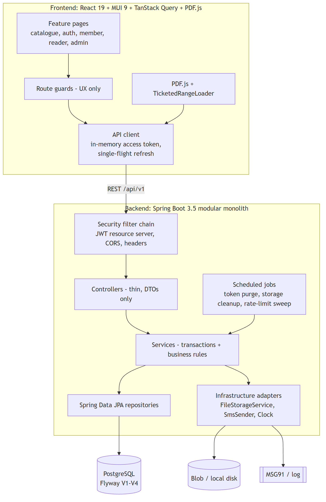

<details><summary>Mermaid source</summary>

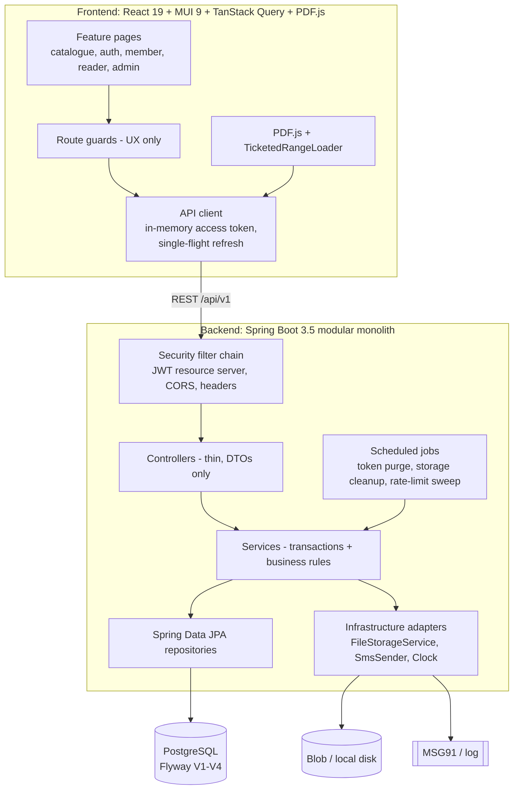
```mermaid
flowchart TB
    subgraph fe [Frontend: React 19 + MUI 9 + TanStack Query + PDF.js]
        pages[Feature pages<br/>catalogue, auth, member, reader, admin]
        guards[Route guards - UX only]
        client[API client<br/>in-memory access token,<br/>single-flight refresh]
        pdfjs[PDF.js + TicketedRangeLoader]
    end

    subgraph be [Backend: Spring Boot 3.5 modular monolith]
        sec[Security filter chain<br/>JWT resource server, CORS, headers]
        ctrl[Controllers - thin, DTOs only]
        svc[Services - transactions + business rules]
        repo[Spring Data JPA repositories]
        infra[Infrastructure adapters<br/>FileStorageService, SmsSender, Clock]
        jobs[Scheduled jobs<br/>token purge, storage cleanup, rate-limit sweep]
    end

    db[(PostgreSQL<br/>Flyway V1-V4)]
    store[(Blob / local disk)]
    sms[[MSG91 / log]]

    pages --> guards --> client
    pdfjs --> client
    client -->|REST /api/v1| sec --> ctrl --> svc
    svc --> repo --> db
    svc --> infra
    infra --> store
    infra --> sms
    jobs --> svc
```

</details>

## 1.5 Key flows (high level)

### Registration and sign-in

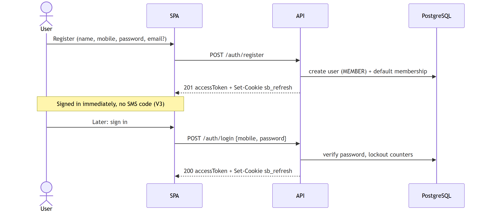

<details><summary>Mermaid source</summary>

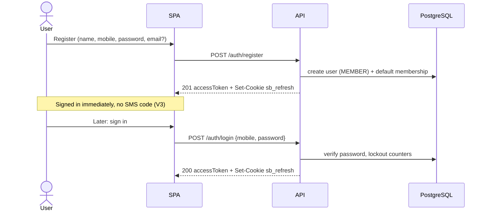
```mermaid
sequenceDiagram
    actor U as User
    participant SPA
    participant API
    participant DB as PostgreSQL

    U->>SPA: Register (name, mobile, password, email?)
    SPA->>API: POST /auth/register
    API->>DB: create user (MEMBER) + default membership
    API-->>SPA: 201 accessToken + Set-Cookie sb_refresh
    Note over U,SPA: Signed in immediately, no SMS code (V3)
    U->>SPA: Later: sign in
    SPA->>API: POST /auth/login {mobile, password}
    API->>DB: verify password, lockout counters
    API-->>SPA: 200 accessToken + Set-Cookie sb_refresh
```

</details>

### Reading a book

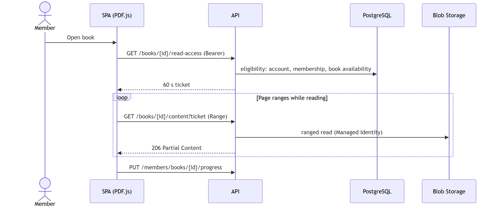

<details><summary>Mermaid source</summary>

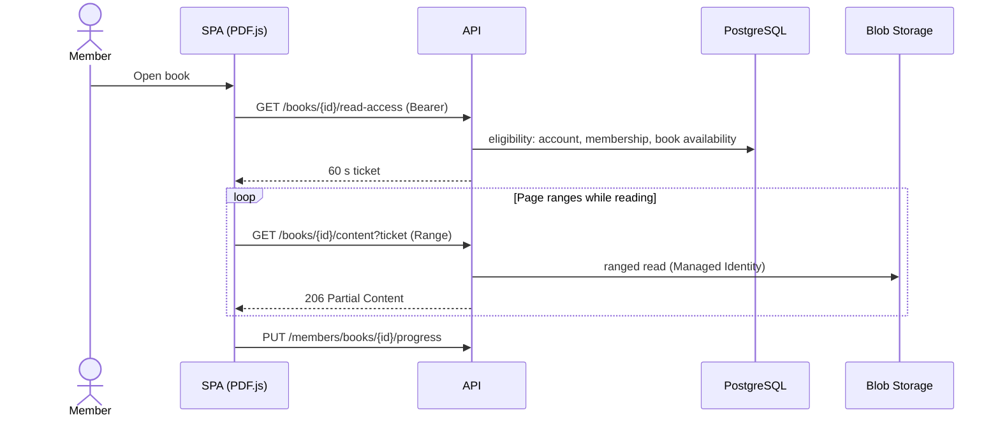
```mermaid
sequenceDiagram
    actor M as Member
    participant SPA as SPA (PDF.js)
    participant API
    participant DB as PostgreSQL
    participant S as Blob Storage

    M->>SPA: Open book
    SPA->>API: GET /books/{id}/read-access (Bearer)
    API->>DB: eligibility: account, membership, book availability
    API-->>SPA: 60 s ticket
    loop Page ranges while reading
        SPA->>API: GET /books/{id}/content?ticket (Range)
        API->>S: ranged read (Managed Identity)
        API-->>SPA: 206 Partial Content
    end
    SPA->>API: PUT /members/books/{id}/progress
```

</details>

### Publishing a book

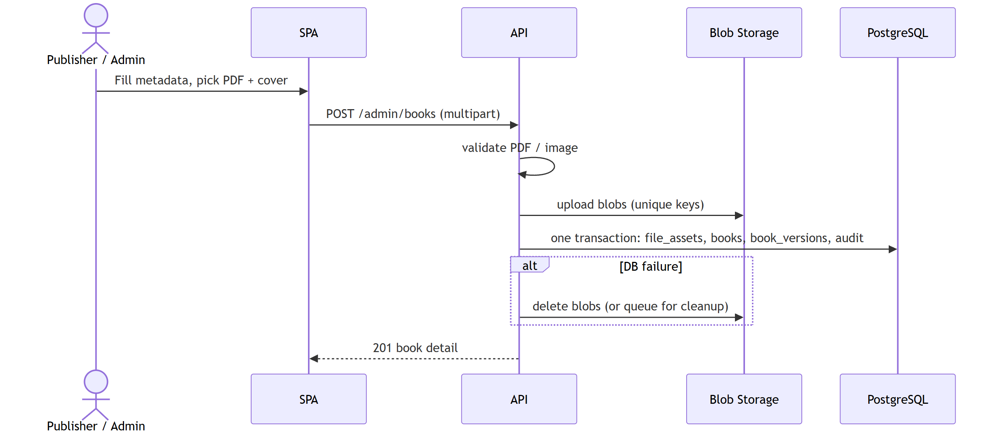

<details><summary>Mermaid source</summary>

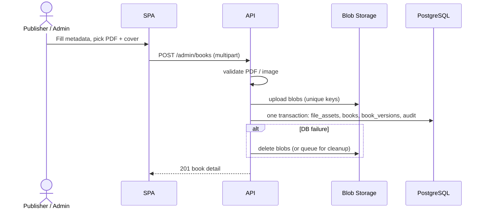
```mermaid
sequenceDiagram
    actor P as Publisher / Admin
    participant SPA
    participant API
    participant S as Blob Storage
    participant DB as PostgreSQL

    P->>SPA: Fill metadata, pick PDF + cover
    SPA->>API: POST /admin/books (multipart)
    API->>API: validate PDF / image
    API->>S: upload blobs (unique keys)
    API->>DB: one transaction: file_assets, books, book_versions, audit
    alt DB failure
        API->>S: delete blobs (or queue for cleanup)
    end
    API-->>SPA: 201 book detail
```

</details>

## 1.6 Cross-cutting concerns

| Concern | Approach |
|---|---|
| Authentication | Short-lived JWT access token (memory only) + rotating opaque refresh token in HttpOnly `SameSite=Strict` cookie scoped to `/api/v1/auth` |
| Authorization | URL rules in `SecurityConfig` + `@PreAuthorize` + ownership checks in services; roles re-read from DB on every request |
| PDF protection | HMAC tickets (60 s), eligibility re-checked on every range request, `Cache-Control: private, no-store` |
| Abuse protection | In-memory sliding-window rate limiter per IP / mobile / user; login lockout; SMS daily cap |
| Consistency | Flyway-owned schema, optimistic locking (`version`), upload-then-commit with compensation for Blob + DB |
| Auditability | `audit_logs` row for every security and admin action |
| Observability | Application Insights Java agent (ticket masked in URLs), actuator health probes, metric alerts |
| Delivery | GitHub Actions: CI (tests, E2E, Bicep build) → dev → approval → prod via staging slot swap |

## 1.7 Environments

| | local | dev (Azure) | prod (Azure) |
|---|---|---|---|
| Database | embedded / docker Postgres | PG Flexible B1ms | PG Flexible D2ds_v5, geo-redundant backups |
| Storage | local disk | Blob LRS | Blob ZRS |
| SMS | `log` provider | `log` (codes in App Insights) | `msg91` |
| Deploy | `mvnw` / `npm run dev` | push to `dev` | push to `main` + `PROD_ENABLED` + approval |

---

# Part 2 — Low-Level Design (LLD)

## 2.1 Backend module structure

Package root `com.example.songbook`. Controllers → services → repositories; infrastructure behind interfaces.

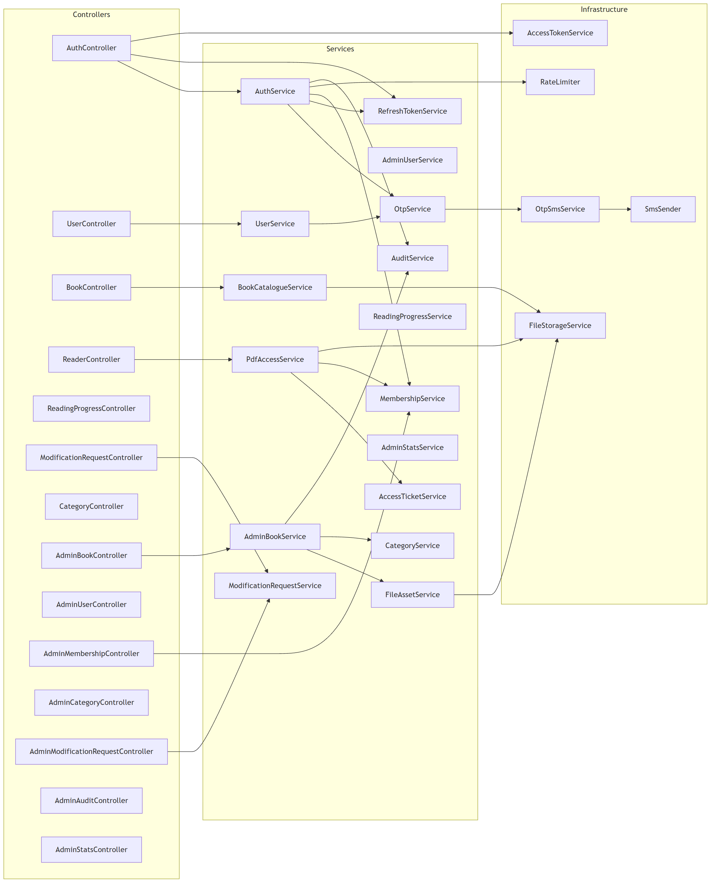

<details><summary>Mermaid source</summary>

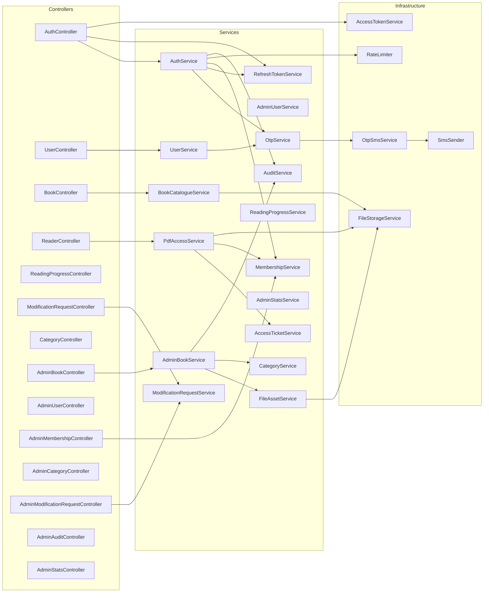
```mermaid
flowchart LR
    subgraph web [Controllers]
        AuthController
        UserController
        BookController
        ReaderController
        ReadingProgressController
        ModificationRequestController
        CategoryController
        AdminBookController
        AdminUserController
        AdminMembershipController
        AdminCategoryController
        AdminModificationRequestController
        AdminAuditController
        AdminStatsController
    end

    subgraph services [Services]
        AuthService
        OtpService
        RefreshTokenService
        UserService
        AdminUserService
        MembershipService
        BookCatalogueService
        AdminBookService
        FileAssetService
        PdfAccessService
        AccessTicketService
        ReadingProgressService
        ModificationRequestService
        CategoryService
        AuditService
        AdminStatsService
    end

    subgraph infra [Infrastructure]
        FileStorageService
        OtpSmsService
        SmsSender
        RateLimiter
        AccessTokenService
    end

    AuthController --> AuthService & RefreshTokenService & AccessTokenService
    AuthService --> OtpService & RefreshTokenService & MembershipService & RateLimiter & AuditService
    UserController --> UserService --> OtpService
    OtpService --> OtpSmsService --> SmsSender
    ReaderController --> PdfAccessService --> AccessTicketService & MembershipService & FileStorageService
    AdminBookController --> AdminBookService --> FileAssetService --> FileStorageService
    AdminBookService --> CategoryService & AuditService
    BookController --> BookCatalogueService --> FileStorageService
    AdminMembershipController --> MembershipService
    ModificationRequestController --> ModificationRequestService
    AdminModificationRequestController --> ModificationRequestService
```

</details>

| Package | Responsibility |
|---|---|
| `config` | `AppProperties` (typed `songbook.*` config), `Clock` in business timezone, OpenAPI, scheduling |
| `common` | `ApiException`, `GlobalExceptionHandler` → `ApiError`, `PageResponse`, `RateLimiter`, `PhoneNumbers` (E.164), token/hash utils |
| `security` | `SecurityConfig`, `JwtConfig`, `AccessTokenService`, `DatabaseJwtAuthenticationConverter`, `CurrentUser`, JSON 401/403 handlers |
| `auth` | Register, login, refresh, logout, forgot/reset password; `otp_codes`, `refresh_tokens`; `TokenPurgeJob` |
| `sms` | `SmsSender` (`Msg91SmsSender`, `LoggingSmsSender`), `OtpSmsService` (send after commit), `SmsConfig` (fail-fast provider selection) |
| `user`, `role` | Profile, password and mobile change, admin user management, last-admin guard, `AdminBootstrap` |
| `membership` | Membership history, `MembershipValidity` rule, default membership at registration |
| `category` | Categories (case-insensitive unique, deactivate instead of delete) |
| `book` | Catalogue queries, admin/publisher management, versions, `BookAvailability` rule |
| `file` | `FileValidator` (magic bytes + PDFBox), `FileAssetService` (compensation), storage impls, `StorageCleanupJob` |
| `reader` | `AccessTicketService`, `PdfAccessService` (single eligibility gate), reading progress |
| `modification` | Member requests and admin review |
| `audit` | `AuditService` writer, `AuditActions`, admin query |
| `admin` | Dashboard stats |

## 2.2 Key classes

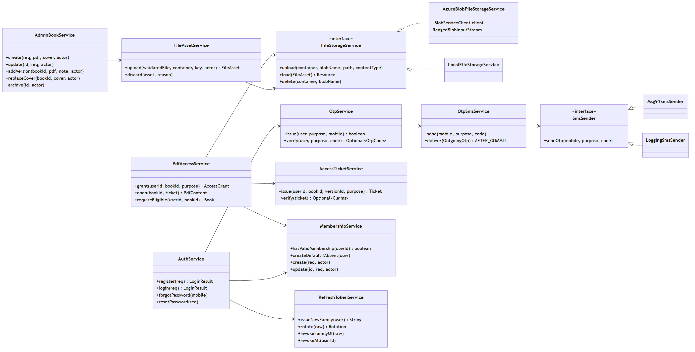

<details><summary>Mermaid source</summary>

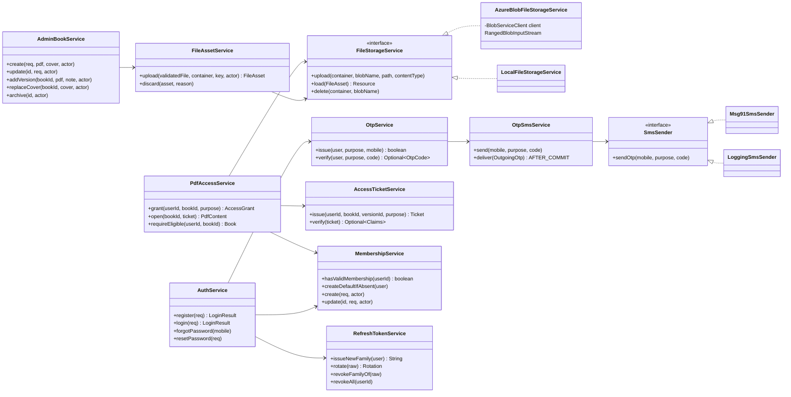
```mermaid
classDiagram
    direction LR

    class FileStorageService {
        <<interface>>
        +upload(container, blobName, path, contentType)
        +load(FileAsset) Resource
        +delete(container, blobName)
    }
    class AzureBlobFileStorageService {
        -BlobServiceClient client
        RangedBlobInputStream
    }
    class LocalFileStorageService
    FileStorageService <|.. AzureBlobFileStorageService
    FileStorageService <|.. LocalFileStorageService

    class SmsSender {
        <<interface>>
        +sendOtp(mobile, purpose, code)
    }
    class Msg91SmsSender
    class LoggingSmsSender
    SmsSender <|.. Msg91SmsSender
    SmsSender <|.. LoggingSmsSender

    class OtpSmsService {
        +send(mobile, purpose, code)
        +deliver(OutgoingOtp) AFTER_COMMIT
    }
    OtpSmsService --> SmsSender

    class OtpService {
        +issue(user, purpose, mobile) boolean
        +verify(user, purpose, code) Optional~OtpCode~
    }
    OtpService --> OtpSmsService

    class AccessTicketService {
        +issue(userId, bookId, versionId, purpose) Ticket
        +verify(ticket) Optional~Claims~
    }
    class PdfAccessService {
        +grant(userId, bookId, purpose) AccessGrant
        +open(bookId, ticket) PdfContent
        +requireEligible(userId, bookId) Book
    }
    PdfAccessService --> AccessTicketService
    PdfAccessService --> FileStorageService
    PdfAccessService --> MembershipService

    class RefreshTokenService {
        +issueNewFamily(user) String
        +rotate(raw) Rotation
        +revokeFamilyOf(raw)
        +revokeAll(userId)
    }
    class AuthService {
        +register(req) LoginResult
        +login(req) LoginResult
        +forgotPassword(mobile)
        +resetPassword(req)
    }
    AuthService --> OtpService
    AuthService --> RefreshTokenService
    AuthService --> MembershipService

    class FileAssetService {
        +upload(validatedFile, container, key, actor) FileAsset
        +discard(asset, reason)
    }
    FileAssetService --> FileStorageService
    class AdminBookService {
        +create(req, pdf, cover, actor)
        +update(id, req, actor)
        +addVersion(bookId, pdf, note, actor)
        +replaceCover(bookId, cover, actor)
        +archive(id, actor)
    }
    AdminBookService --> FileAssetService

    class MembershipService {
        +hasValidMembership(userId) boolean
        +createDefaultIfAbsent(user)
        +create(req, actor)
        +update(id, req, actor)
    }
```

</details>

## 2.3 Data model

Full constraints and indexes: [DATABASE_ERD.md](DATABASE_ERD.md). Schema is owned by Flyway; Hibernate runs in
`validate` mode.

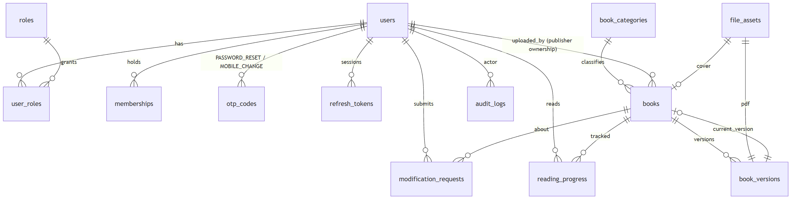

<details><summary>Mermaid source</summary>

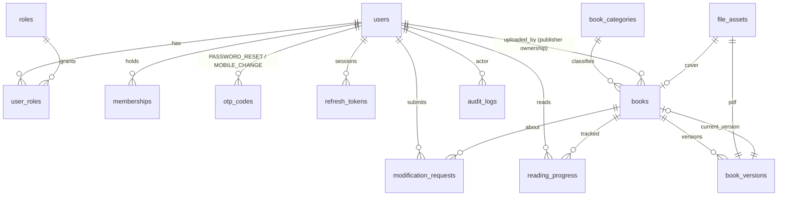
```mermaid
erDiagram
    users ||--o{ user_roles : has
    roles ||--o{ user_roles : grants
    users ||--o{ memberships : holds
    users ||--o{ otp_codes : "PASSWORD_RESET / MOBILE_CHANGE"
    users ||--o{ refresh_tokens : sessions
    book_categories ||--o{ books : classifies
    users ||--o{ books : "uploaded_by (publisher ownership)"
    file_assets ||--o| books : cover
    books ||--o{ book_versions : versions
    book_versions ||--o| books : current_version
    file_assets ||--|| book_versions : pdf
    users ||--o{ reading_progress : reads
    books ||--o{ reading_progress : tracked
    users ||--o{ modification_requests : submits
    books ||--o{ modification_requests : about
    users ||--o{ audit_logs : actor
```

</details>

`storage_cleanup_queue` is a standalone table (no foreign keys) holding orphaned blob keys for the cleanup job.

| Migration | Change |
|---|---|
| V1 | Initial schema (users, roles, memberships, categories, books, versions, file assets, tokens, progress, requests, audit, cleanup queue) |
| V2 | Mobile number (E.164) as identity; `otp_codes` replaces email tokens |
| V3 | Registration needs no SMS code; OTP purposes limited to `PASSWORD_RESET`, `MOBILE_CHANGE` |
| V4 | `PUBLISHER` role; index on `books.uploaded_by` |

## 2.4 Domain state models

### Book status and availability

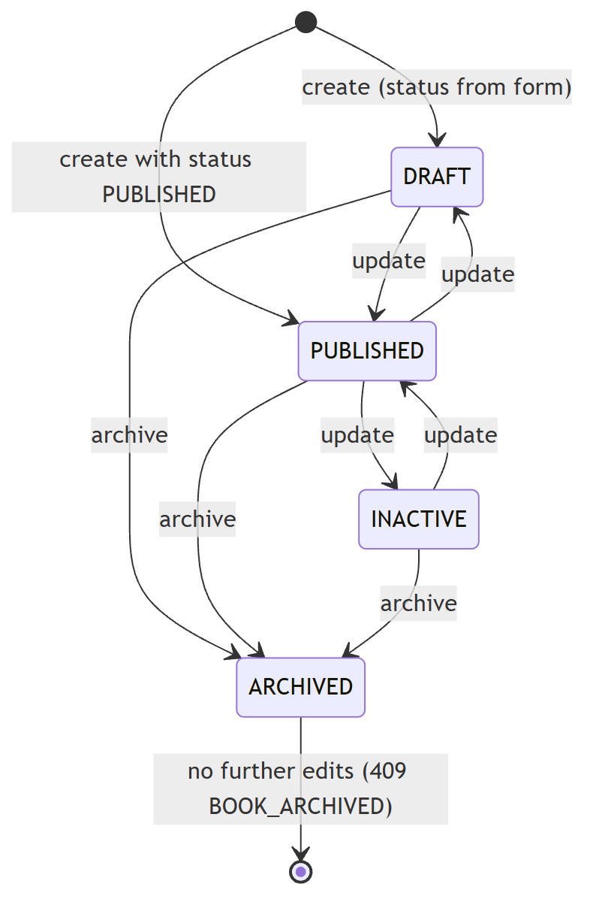

<details><summary>Mermaid source</summary>

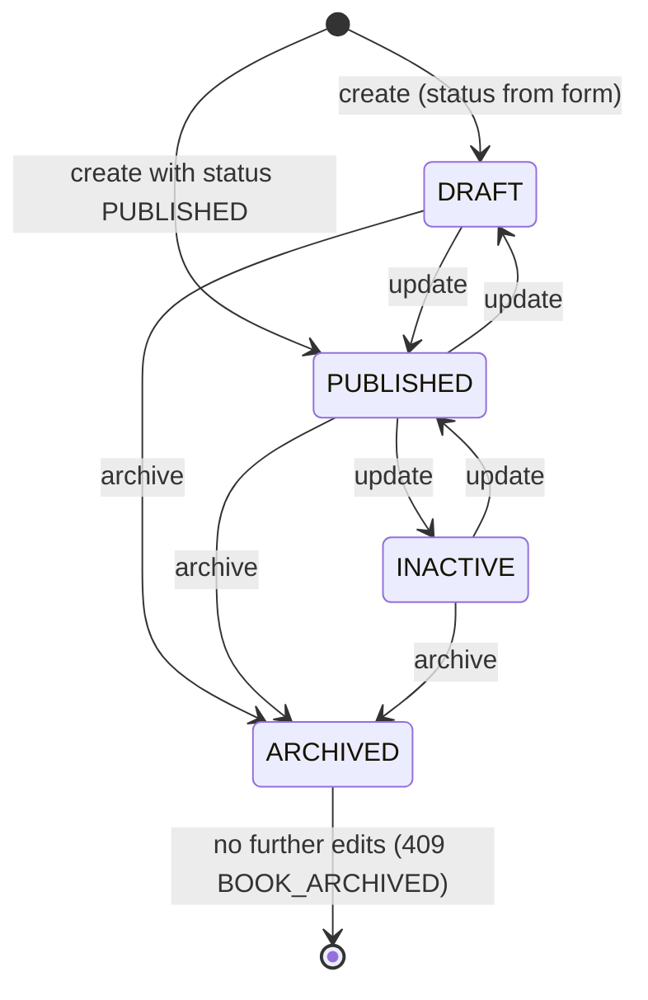
```mermaid
stateDiagram-v2
    [*] --> DRAFT: create (status from form)
    [*] --> PUBLISHED: create with status PUBLISHED
    DRAFT --> PUBLISHED: update
    PUBLISHED --> INACTIVE: update
    INACTIVE --> PUBLISHED: update
    PUBLISHED --> DRAFT: update
    DRAFT --> ARCHIVED: archive
    PUBLISHED --> ARCHIVED: archive
    INACTIVE --> ARCHIVED: archive
    ARCHIVED --> [*]: no further edits (409 BOOK_ARCHIVED)
```

</details>

A book is **available** (visible in the catalogue and readable) only when
`status = PUBLISHED` and `effective_date <= today <= expiry_date` (null expiry = open-ended), with `today` taken
from the business-timezone `Clock` (`BookAvailability`). Unavailable books answer 404.

### Membership

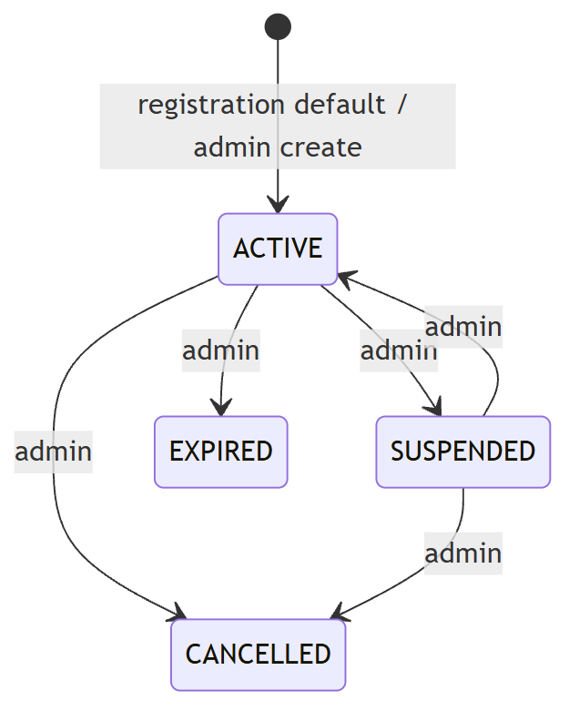

<details><summary>Mermaid source</summary>

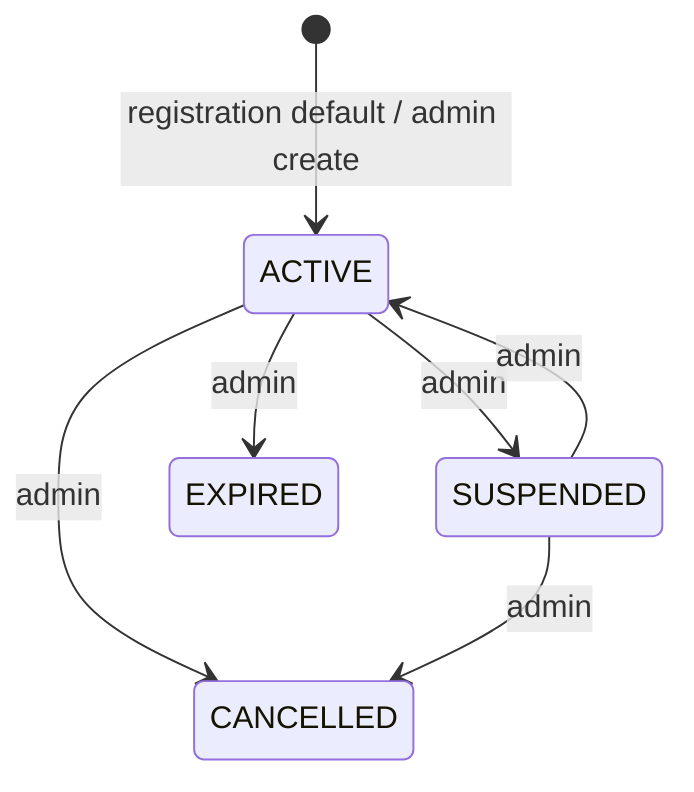
```mermaid
stateDiagram-v2
    [*] --> ACTIVE: registration default / admin create
    ACTIVE --> SUSPENDED: admin
    SUSPENDED --> ACTIVE: admin
    ACTIVE --> EXPIRED: admin
    ACTIVE --> CANCELLED: admin
    SUSPENDED --> CANCELLED: admin
```

</details>

At most one `ACTIVE` row per user (partial unique index). **Valid today** = `ACTIVE` and
`start_date <= today <= end_date` (null end = no end) — `MembershipValidity`.

### Account

`ACTIVE` | `DISABLED` (admin) | `LOCKED`; additionally a temporary lock via `locked_until` after repeated failed
logins. `User.canAuthenticate(now)` is checked by the JWT converter, refresh rotation and PDF eligibility.

## 2.5 Detailed sequence diagrams

### 2.5.1 Authenticated request (JWT → current DB state)

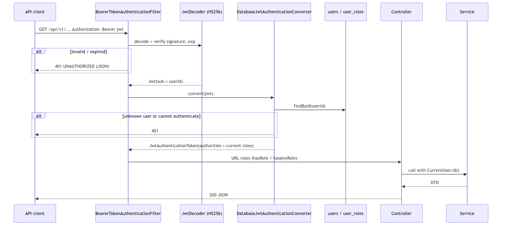

<details><summary>Mermaid source</summary>

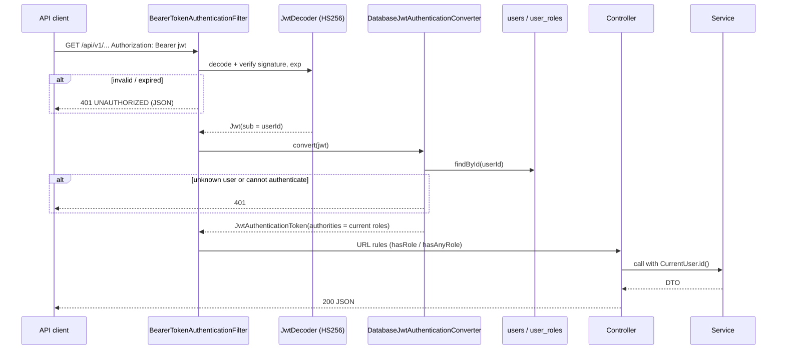
```mermaid
sequenceDiagram
    participant C as API client
    participant F as BearerTokenAuthenticationFilter
    participant J as JwtDecoder (HS256)
    participant K as DatabaseJwtAuthenticationConverter
    participant DB as users / user_roles
    participant Ctl as Controller
    participant Svc as Service

    C->>F: GET /api/v1/... Authorization: Bearer jwt
    F->>J: decode + verify signature, exp
    alt invalid / expired
        F-->>C: 401 UNAUTHORIZED (JSON)
    end
    J-->>F: Jwt(sub = userId)
    F->>K: convert(jwt)
    K->>DB: findById(userId)
    alt unknown user or cannot authenticate
        K-->>C: 401
    end
    K-->>F: JwtAuthenticationToken(authorities = current roles)
    F->>Ctl: URL rules (hasRole / hasAnyRole)
    Ctl->>Svc: call with CurrentUser.id()
    Svc-->>Ctl: DTO
    Ctl-->>C: 200 JSON
```

</details>

Disabling a user or removing a role therefore takes effect on the next request, not at token expiry.

### 2.5.2 Login with lockout


<details><summary>Mermaid source</summary>

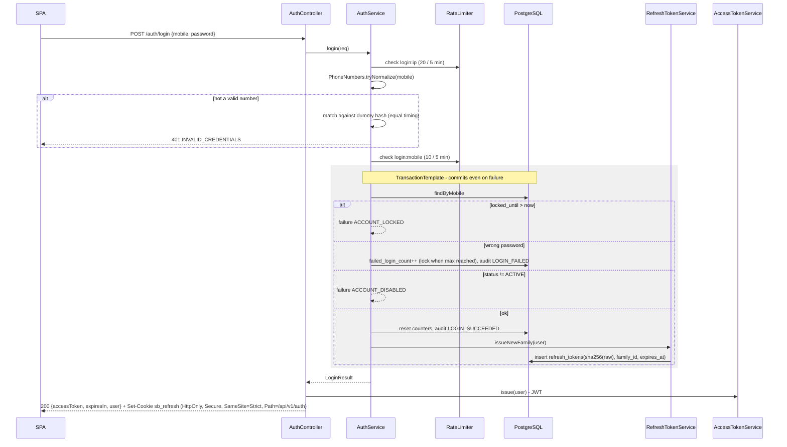
```mermaid
sequenceDiagram
    participant SPA
    participant AC as AuthController
    participant AS as AuthService
    participant RL as RateLimiter
    participant DB as PostgreSQL
    participant RT as RefreshTokenService
    participant AT as AccessTokenService

    SPA->>AC: POST /auth/login {mobile, password}
    AC->>AS: login(req)
    AS->>RL: check login:ip (20 / 5 min)
    AS->>AS: PhoneNumbers.tryNormalize(mobile)
    alt not a valid number
        AS->>AS: match against dummy hash (equal timing)
        AS-->>SPA: 401 INVALID_CREDENTIALS
    end
    AS->>RL: check login:mobile (10 / 5 min)
    rect rgb(240, 240, 240)
        Note over AS,DB: TransactionTemplate - commits even on failure
        AS->>DB: findByMobile
        alt locked_until > now
            AS-->>AS: failure ACCOUNT_LOCKED
        else wrong password
            AS->>DB: failed_login_count++ (lock when max reached), audit LOGIN_FAILED
        else status != ACTIVE
            AS-->>AS: failure ACCOUNT_DISABLED
        else ok
            AS->>DB: reset counters, audit LOGIN_SUCCEEDED
            AS->>RT: issueNewFamily(user)
            RT->>DB: insert refresh_tokens(sha256(raw), family_id, expires_at)
        end
    end
    AS-->>AC: LoginResult
    AC->>AT: issue(user) - JWT
    AC-->>SPA: 200 {accessToken, expiresIn, user} + Set-Cookie sb_refresh (HttpOnly, Secure, SameSite=Strict, Path=/api/v1/auth)
```

</details>

### 2.5.3 Silent refresh with rotation and reuse detection


<details><summary>Mermaid source</summary>

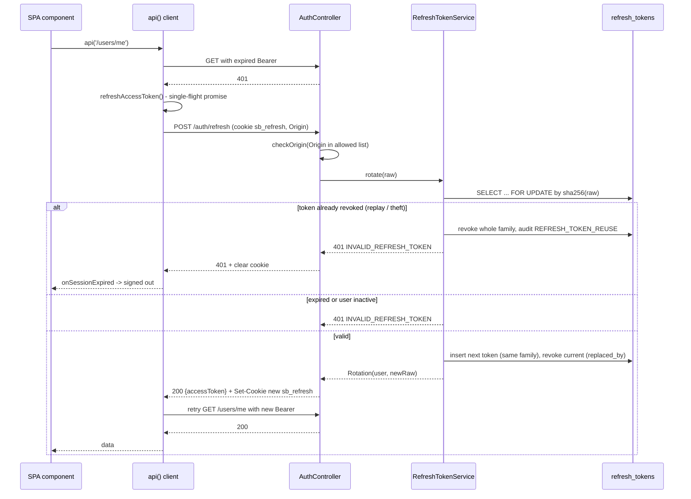
```mermaid
sequenceDiagram
    participant UI as SPA component
    participant CL as api() client
    participant AC as AuthController
    participant RT as RefreshTokenService
    participant DB as refresh_tokens

    UI->>CL: api('/users/me')
    CL->>AC: GET with expired Bearer
    AC-->>CL: 401
    CL->>CL: refreshAccessToken() - single-flight promise
    CL->>AC: POST /auth/refresh (cookie sb_refresh, Origin)
    AC->>AC: checkOrigin(Origin in allowed list)
    AC->>RT: rotate(raw)
    RT->>DB: SELECT ... FOR UPDATE by sha256(raw)
    alt token already revoked (replay / theft)
        RT->>DB: revoke whole family, audit REFRESH_TOKEN_REUSE
        RT-->>AC: 401 INVALID_REFRESH_TOKEN
        AC-->>CL: 401 + clear cookie
        CL-->>UI: onSessionExpired -> signed out
    else expired or user inactive
        RT-->>AC: 401 INVALID_REFRESH_TOKEN
    else valid
        RT->>DB: insert next token (same family), revoke current (replaced_by)
        RT-->>AC: Rotation(user, newRaw)
        AC-->>CL: 200 {accessToken} + Set-Cookie new sb_refresh
        CL->>AC: retry GET /users/me with new Bearer
        AC-->>CL: 200
        CL-->>UI: data
    end
```

</details>

On page load `AuthContext` calls the same refresh endpoint to restore the session (the access token is never
persisted).

### 2.5.4 Forgot / reset password (SMS OTP)

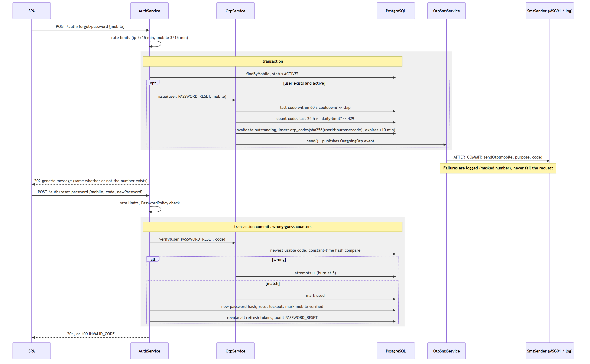

<details><summary>Mermaid source</summary>

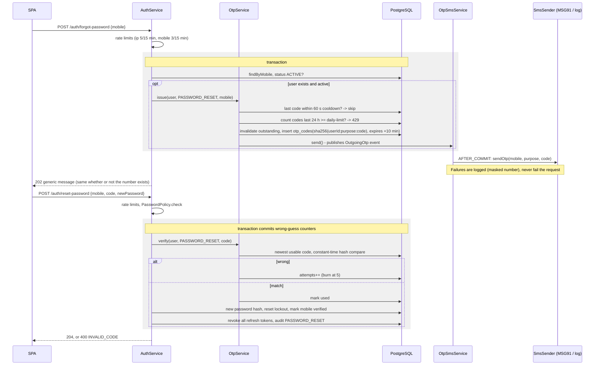
```mermaid
sequenceDiagram
    participant SPA
    participant AS as AuthService
    participant OS as OtpService
    participant DB as PostgreSQL
    participant SM as OtpSmsService
    participant SS as SmsSender (MSG91 / log)

    SPA->>AS: POST /auth/forgot-password {mobile}
    AS->>AS: rate limits (ip 5/15 min, mobile 3/15 min)
    rect rgb(240, 240, 240)
        Note over AS,DB: transaction
        AS->>DB: findByMobile, status ACTIVE?
        opt user exists and active
            AS->>OS: issue(user, PASSWORD_RESET, mobile)
            OS->>DB: last code within 60 s cooldown? -> skip
            OS->>DB: count codes last 24 h >= daily-limit? -> 429
            OS->>DB: invalidate outstanding, insert otp_codes(sha256(userId:purpose:code), expires +10 min)
            OS->>SM: send() - publishes OutgoingOtp event
        end
    end
    SM->>SS: AFTER_COMMIT: sendOtp(mobile, purpose, code)
    Note over SM,SS: Failures are logged (masked number), never fail the request
    AS-->>SPA: 202 generic message (same whether or not the number exists)

    SPA->>AS: POST /auth/reset-password {mobile, code, newPassword}
    AS->>AS: rate limits, PasswordPolicy.check
    rect rgb(240, 240, 240)
        Note over AS,DB: transaction commits wrong-guess counters
        AS->>OS: verify(user, PASSWORD_RESET, code)
        OS->>DB: newest usable code, constant-time hash compare
        alt wrong
            OS->>DB: attempts++ (burn at 5)
        else match
            OS->>DB: mark used
            AS->>DB: new password hash, reset lockout, mark mobile verified
            AS->>DB: revoke all refresh tokens, audit PASSWORD_RESET
        end
    end
    AS-->>SPA: 204, or 400 INVALID_CODE
```

</details>

### 2.5.5 Mobile number change

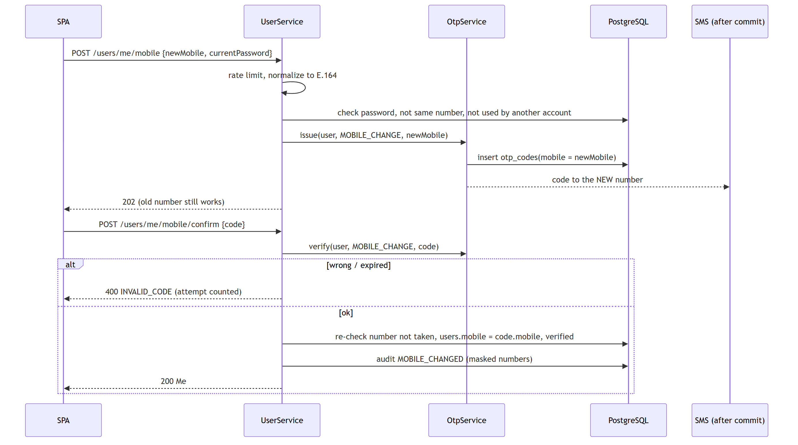

<details><summary>Mermaid source</summary>

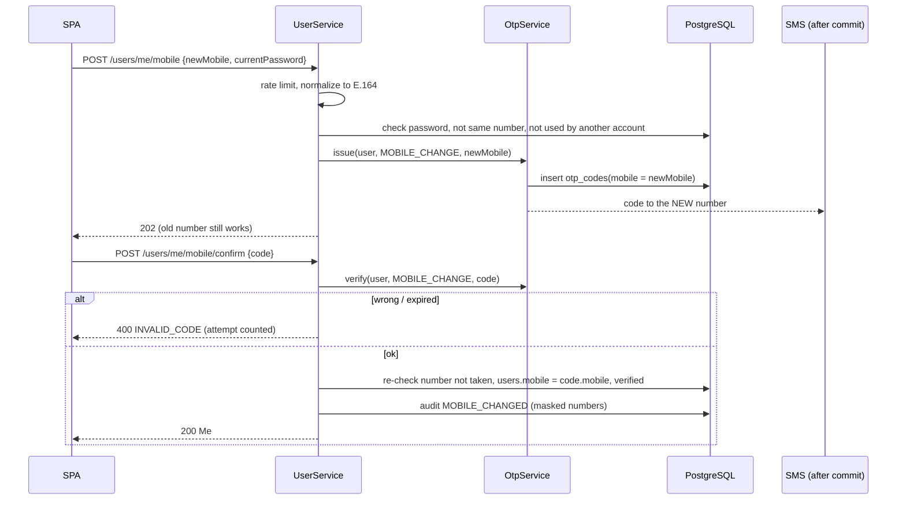
```mermaid
sequenceDiagram
    participant SPA
    participant US as UserService
    participant OS as OtpService
    participant DB as PostgreSQL
    participant SMS as SMS (after commit)

    SPA->>US: POST /users/me/mobile {newMobile, currentPassword}
    US->>US: rate limit, normalize to E.164
    US->>DB: check password, not same number, not used by another account
    US->>OS: issue(user, MOBILE_CHANGE, newMobile)
    OS->>DB: insert otp_codes(mobile = newMobile)
    OS-->>SMS: code to the NEW number
    US-->>SPA: 202 (old number still works)

    SPA->>US: POST /users/me/mobile/confirm {code}
    US->>OS: verify(user, MOBILE_CHANGE, code)
    alt wrong / expired
        US-->>SPA: 400 INVALID_CODE (attempt counted)
    else ok
        US->>DB: re-check number not taken, users.mobile = code.mobile, verified
        US->>DB: audit MOBILE_CHANGED (masked numbers)
        US-->>SPA: 200 Me
    end
```

</details>

### 2.5.6 Reading a PDF (ticket + ranged streaming)

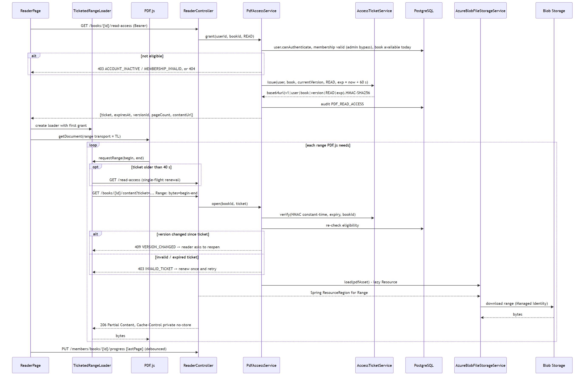

<details><summary>Mermaid source</summary>

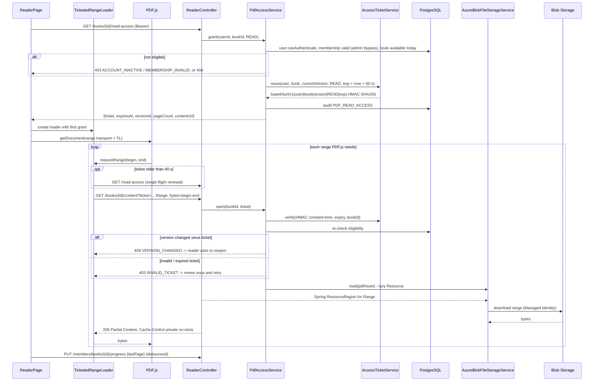
```mermaid
sequenceDiagram
    participant RP as ReaderPage
    participant TL as TicketedRangeLoader
    participant PJ as PDF.js
    participant RC as ReaderController
    participant PA as PdfAccessService
    participant TS as AccessTicketService
    participant DB as PostgreSQL
    participant FS as AzureBlobFileStorageService
    participant B as Blob Storage

    RP->>RC: GET /books/{id}/read-access (Bearer)
    RC->>PA: grant(userId, bookId, READ)
    PA->>DB: user.canAuthenticate, membership valid (admin bypass), book available today
    alt not eligible
        PA-->>RP: 403 ACCOUNT_INACTIVE / MEMBERSHIP_INVALID, or 404
    end
    PA->>TS: issue(user, book, currentVersion, READ, exp = now + 60 s)
    TS-->>PA: base64url(v1|user|book|version|READ|exp).HMAC-SHA256
    PA->>DB: audit PDF_READ_ACCESS
    PA-->>RP: {ticket, expiresAt, versionId, pageCount, contentUrl}
    RP->>TL: create loader with first grant
    RP->>PJ: getDocument(range transport = TL)

    loop each range PDF.js needs
        PJ->>TL: requestRange(begin, end)
        opt ticket older than 40 s
            TL->>RC: GET /read-access (single-flight renewal)
        end
        TL->>RC: GET /books/{id}/content?ticket=... Range: bytes=begin-end
        RC->>PA: open(bookId, ticket)
        PA->>TS: verify(HMAC constant-time, expiry, bookId)
        PA->>DB: re-check eligibility
        alt version changed since ticket
            PA-->>TL: 409 VERSION_CHANGED -> reader asks to reopen
        else invalid / expired ticket
            PA-->>TL: 403 INVALID_TICKET -> renew once and retry
        end
        PA->>FS: load(pdfAsset) - lazy Resource
        RC-->>FS: Spring ResourceRegion for Range
        FS->>B: download range (Managed Identity)
        B-->>FS: bytes
        RC-->>TL: 206 Partial Content, Cache-Control private no-store
        TL-->>PJ: bytes
    end
    RP->>RC: PUT /members/books/{id}/progress {lastPage} (debounced)
```

</details>

Download is the same flow with `/download-access` and `Purpose.DOWNLOAD`, which returns
`Content-Disposition: attachment; filename="<safe title>.pdf"`. The blob read happens outside the
database transaction (fix in `6214371`), so slow storage never holds a DB connection.

### 2.5.7 Create a book (upload, commit, compensate)

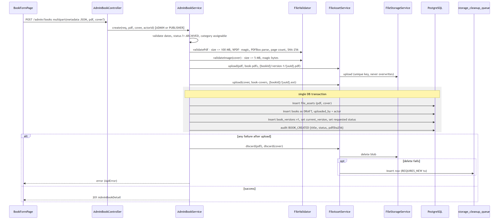

<details><summary>Mermaid source</summary>

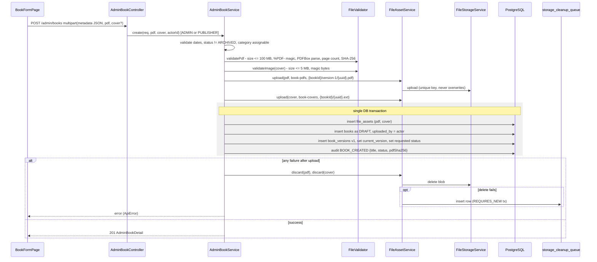
```mermaid
sequenceDiagram
    participant SPA as BookFormPage
    participant AB as AdminBookController
    participant BS as AdminBookService
    participant FV as FileValidator
    participant FA as FileAssetService
    participant ST as FileStorageService
    participant DB as PostgreSQL
    participant CQ as storage_cleanup_queue

    SPA->>AB: POST /admin/books multipart(metadata JSON, pdf, cover?)
    AB->>BS: create(req, pdf, cover, actorId)  [ADMIN or PUBLISHER]
    BS->>BS: validate dates, status != ARCHIVED, category assignable
    BS->>FV: validatePdf - size <= 100 MB, %PDF- magic, PDFBox parse, page count, SHA-256
    BS->>FV: validateImage(cover) - size <= 5 MB, magic bytes
    BS->>FA: upload(pdf, book-pdfs, {bookId}/version-1/{uuid}.pdf)
    FA->>ST: upload (unique key, never overwrites)
    BS->>FA: upload(cover, book-covers, {bookId}/{uuid}.ext)
    rect rgb(240, 240, 240)
        Note over BS,DB: single DB transaction
        BS->>DB: insert file_assets (pdf, cover)
        BS->>DB: insert books as DRAFT, uploaded_by = actor
        BS->>DB: insert book_versions v1, set current_version, set requested status
        BS->>DB: audit BOOK_CREATED {title, status, pdfSha256}
    end
    alt any failure after upload
        BS->>FA: discard(pdf), discard(cover)
        FA->>ST: delete blob
        opt delete fails
            FA->>CQ: insert row (REQUIRES_NEW tx)
        end
        BS-->>SPA: error (ApiError)
    else success
        BS-->>SPA: 201 AdminBookDetail
    end
```

</details>

Books are inserted as `DRAFT` first because a `CHECK` constraint forbids a `PUBLISHED` row without a
`current_version_id`.

### 2.5.8 Upload a new PDF version

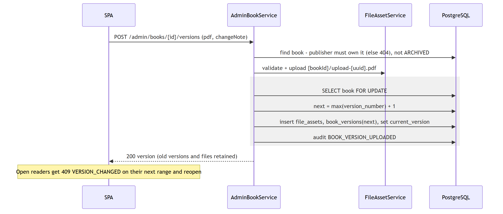

<details><summary>Mermaid source</summary>

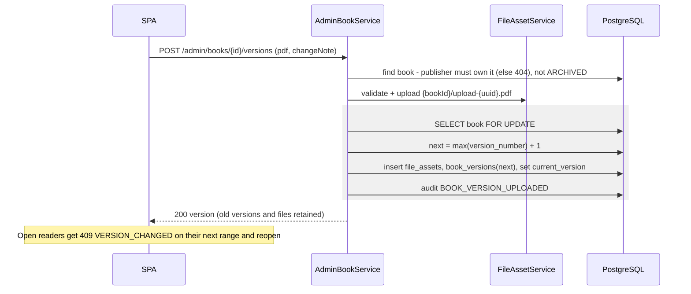
```mermaid
sequenceDiagram
    participant SPA
    participant BS as AdminBookService
    participant FA as FileAssetService
    participant DB as PostgreSQL

    SPA->>BS: POST /admin/books/{id}/versions (pdf, changeNote)
    BS->>DB: find book - publisher must own it (else 404), not ARCHIVED
    BS->>FA: validate + upload {bookId}/upload-{uuid}.pdf
    rect rgb(240, 240, 240)
        BS->>DB: SELECT book FOR UPDATE
        BS->>DB: next = max(version_number) + 1
        BS->>DB: insert file_assets, book_versions(next), set current_version
        BS->>DB: audit BOOK_VERSION_UPLOADED
    end
    BS-->>SPA: 200 version (old versions and files retained)
    Note over SPA: Open readers get 409 VERSION_CHANGED on their next range and reopen
```

</details>

### 2.5.9 Membership administration

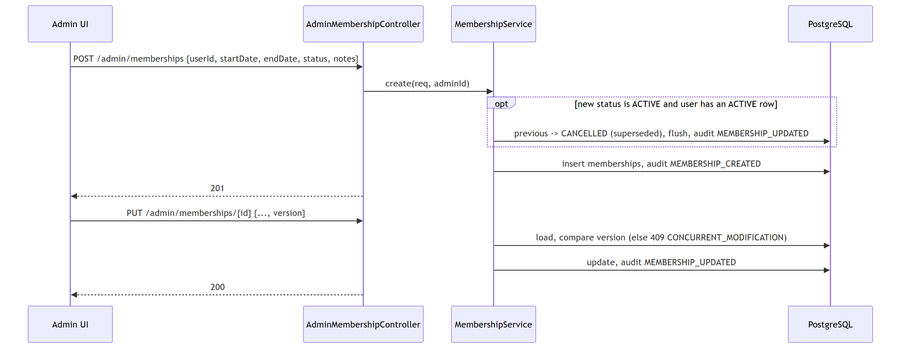

<details><summary>Mermaid source</summary>

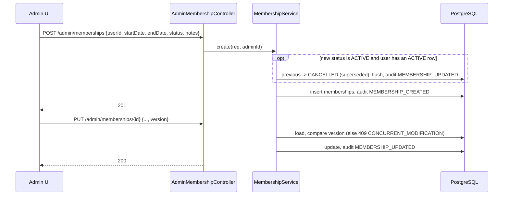
```mermaid
sequenceDiagram
    participant Admin as Admin UI
    participant MC as AdminMembershipController
    participant MS as MembershipService
    participant DB as PostgreSQL

    Admin->>MC: POST /admin/memberships {userId, startDate, endDate, status, notes}
    MC->>MS: create(req, adminId)
    opt new status is ACTIVE and user has an ACTIVE row
        MS->>DB: previous -> CANCELLED (superseded), flush, audit MEMBERSHIP_UPDATED
    end
    MS->>DB: insert memberships, audit MEMBERSHIP_CREATED
    MC-->>Admin: 201

    Admin->>MC: PUT /admin/memberships/{id} {..., version}
    MS->>DB: load, compare version (else 409 CONCURRENT_MODIFICATION)
    MS->>DB: update, audit MEMBERSHIP_UPDATED
    MC-->>Admin: 200
```

</details>

### 2.5.10 Modification request lifecycle

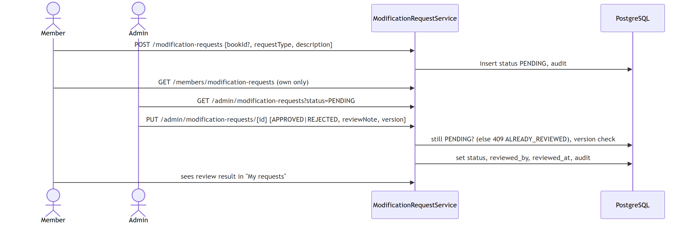

<details><summary>Mermaid source</summary>

```mermaid
sequenceDiagram
    actor M as Member
    actor A as Admin
    participant API as ModificationRequestService
    participant DB as PostgreSQL

    M->>API: POST /modification-requests {bookId?, requestType, description}
    API->>DB: insert status PENDING, audit
    M->>API: GET /members/modification-requests (own only)
    A->>API: GET /admin/modification-requests?status=PENDING
    A->>API: PUT /admin/modification-requests/{id} {APPROVED|REJECTED, reviewNote, version}
    API->>DB: still PENDING? (else 409 ALREADY_REVIEWED), version check
    API->>DB: set status, reviewed_by, reviewed_at, audit
    M->>API: sees review result in "My requests"
```

</details>

### 2.5.11 Background jobs

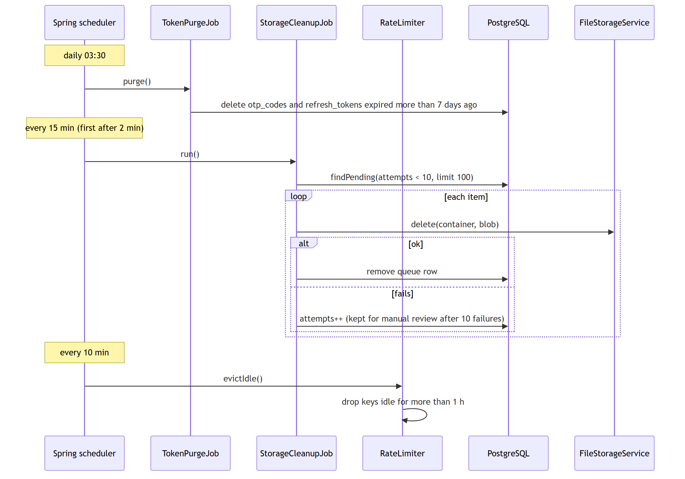

<details><summary>Mermaid source</summary>

```mermaid
sequenceDiagram
    participant Sch as Spring scheduler
    participant TP as TokenPurgeJob
    participant SC as StorageCleanupJob
    participant RL as RateLimiter
    participant DB as PostgreSQL
    participant ST as FileStorageService

    Note over Sch: daily 03:30
    Sch->>TP: purge()
    TP->>DB: delete otp_codes and refresh_tokens expired more than 7 days ago

    Note over Sch: every 15 min (first after 2 min)
    Sch->>SC: run()
    SC->>DB: findPending(attempts < 10, limit 100)
    loop each item
        SC->>ST: delete(container, blob)
        alt ok
            SC->>DB: remove queue row
        else fails
            SC->>DB: attempts++ (kept for manual review after 10 failures)
        end
    end

    Note over Sch: every 10 min
    Sch->>RL: evictIdle()
    RL->>RL: drop keys idle for more than 1 h
```

</details>

## 2.6 Frontend design

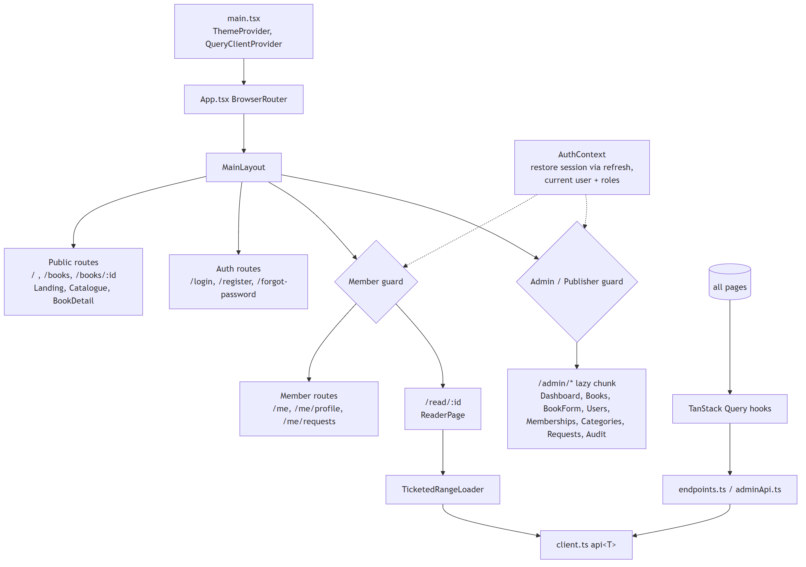

<details><summary>Mermaid source</summary>

```mermaid
flowchart TB
    main[main.tsx<br/>ThemeProvider, QueryClientProvider] --> App
    App[App.tsx BrowserRouter] --> Layout[MainLayout]
    Layout --> Public["Public routes<br/>/ , /books, /books/:id<br/>Landing, Catalogue, BookDetail"]
    Layout --> Auth["Auth routes<br/>/login, /register, /forgot-password"]
    Layout --> MemberG{Member guard}
    MemberG --> Me["Member routes<br/>/me, /me/profile, /me/requests"]
    MemberG --> Reader["/read/:id<br/>ReaderPage"]
    Layout --> AdminG{Admin / Publisher guard}
    AdminG --> AdminRoutes["/admin/* lazy chunk<br/>Dashboard, Books, BookForm, Users,<br/>Memberships, Categories, Requests, Audit"]

    AuthCtx[AuthContext<br/>restore session via refresh,<br/>current user + roles] -.-> MemberG & AdminG
    Pages[(all pages)] --> Query[TanStack Query hooks]
    Query --> Endpoints[endpoints.ts / adminApi.ts]
    Endpoints --> Client[client.ts api&lt;T&gt;]
    Reader --> Loader[TicketedRangeLoader] --> Client
```

</details>

| Concern | Implementation |
|---|---|
| Token storage | Access token in a module variable only; refresh token is an HttpOnly cookie |
| 401 handling | One single-flight refresh, then retry once; if it fails `onSessionExpired` signs the UI out |
| API origin | `VITE_API_BASE_URL` substituted at build time (cross-origin in Azure) |
| Guards | UX only; every permission is enforced by the API |
| Reader | PDF.js with a custom range transport, ticket renewal at 40 s, text-layer search, debounced progress save |
| Errors | `ApiError {status, code, fieldErrors}` mapped to form helper text and status pages |

## 2.7 Error model

`ApiException(status, code, message)` thrown from services is translated by `GlobalExceptionHandler` into:

```json
{ "timestamp": "...", "status": 409, "code": "CONCURRENT_MODIFICATION",
  "message": "...", "path": "/api/v1/admin/books/...", "fieldErrors": [] }
```

Security failures before the controller (missing / bad JWT, forbidden URL) go through
`JsonSecurityErrorHandlers` with the same shape. Codes are listed in
[API_SPECIFICATION.md](API_SPECIFICATION.md#conventions).

## 2.8 Security parameters

| Parameter | Value | Where |
|---|---|---|
| Access token | JWT HS256, 15 min, `sub` = user id | `AccessTokenService`, `JwtConfig` |
| Refresh token | 256-bit opaque, SHA-256 stored, 14 days, rotated, family revocation on reuse | `RefreshTokenService` |
| PDF ticket | HMAC-SHA256, 60 s, bound to user + book + version + purpose | `AccessTicketService` |
| OTP | 6 digits, 10 min, 5 attempts, 60 s resend cooldown, global daily cap | `OtpService`, `songbook.sms.*` |
| Passwords | Delegating encoder (BCrypt), 10–128 chars, not equal to mobile | `PasswordPolicy` |
| Rate limits | login 20/5 min per IP + 10/5 min per mobile; register 5/10 min per IP + 3/15 min per mobile; forgot 5/15 min per IP + 3/15 min per mobile; mobile change 5/15 min per user | `RateLimiter` (per instance) |
| Secrets | Key Vault references; app fails to start without them unless `allow-generated-secrets` | `SecretKeys`, Bicep |
| Headers | `nosniff`, `X-Frame-Options: DENY`, `Referrer-Policy: no-referrer`; SPA CSP from `write-swa-config.mjs` | `SecurityConfig`, SWA |

## 2.9 Configuration (`songbook.*`)

| Key | Default | Purpose |
|---|---|---|
| `business-timezone` | `UTC` (`SONGBOOK_TIMEZONE`) | Calendar "today" for memberships and book windows |
| `membership.default-duration-days` | 365 (0 = no end) | Default membership at registration |
| `membership.admins-bypass-membership` | true | Admins read without a membership (D3) |
| `storage.provider` | `local` / `azure` | Selects `FileStorageService` implementation |
| `storage.max-pdf-bytes` / `max-image-bytes` | 100 MB / 5 MB | Upload limits |
| `sms.provider` | `log` / `msg91` | `log` refused unless `allow-log-provider=true` |
| `sms.msg91.template-otp`, `otp-variable` | — / `otp` | One DLT template for all codes |
| `bootstrap.admin-*` | — | Creates the first admin at startup if none exists |

## 2.10 Scalability notes and known limits

- `RateLimiter` is in-memory: with more than one App Service instance, move to Redis or an edge WAF rule.
- PDF bytes flow through the API (ADR-4). If egress becomes a bottleneck, switch to user-delegation SAS with
  very short expiry.
- Catalogue search uses `ILIKE`; add a `tsvector` index if the catalogue grows large.
- PostgreSQL uses public access with "Allow Azure services"; private networking is in the backlog.
